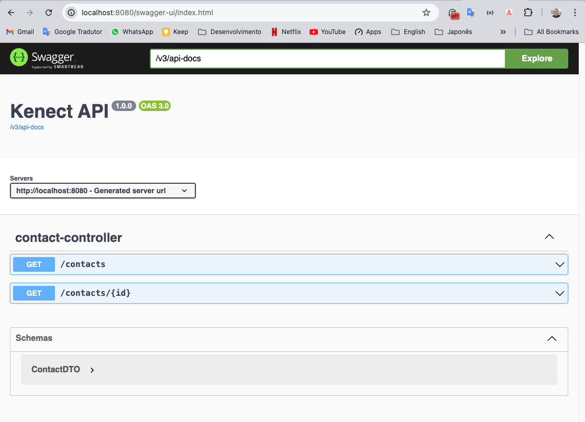
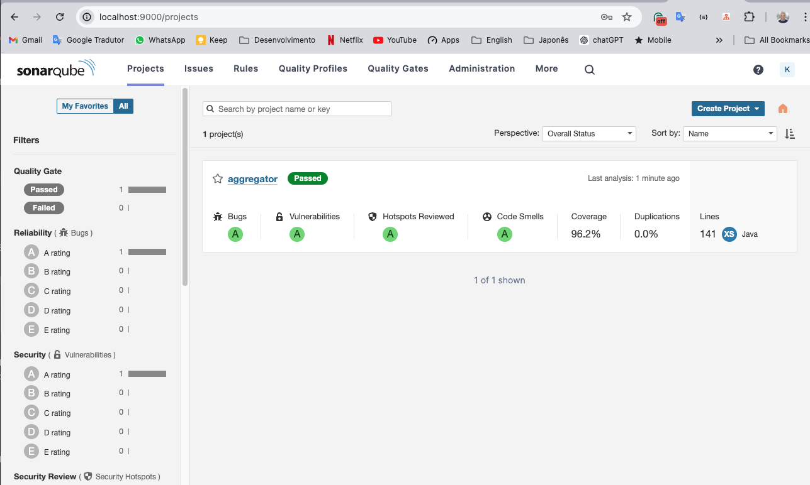
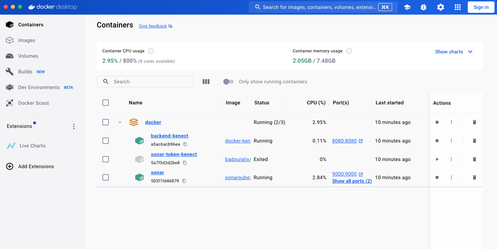
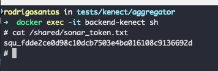
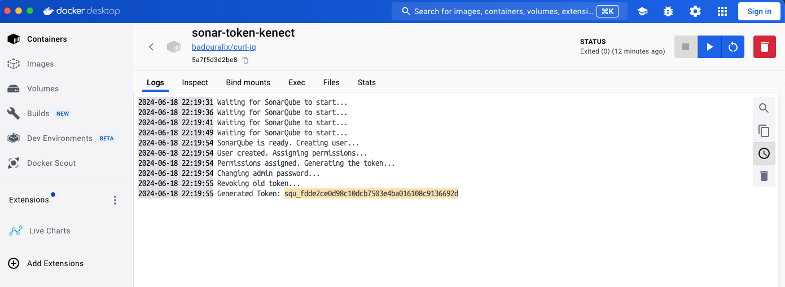

# Kenect: Take Home API Test Project

## Overview

Provided a list contacts retrieve from the Kenect Labs API.

### Backend
- Java with Spring Boot for business logic and communication with external services.

### Additional Tools
- **Swagger for API endpoint documentation**


  <p align="center">
    
  </p>

- **SonarQube for static code analysis**
    ```
    user: kenect
    password: k3n3ct
    ```

  <p align="center">
    
  </p>


### Docker Integration
- Docker and Docker Compose are used to containerize and manage the entire application stack, providing easy setup and deployment.


  <p align="center">
    
  </p>


## Environment Setup

### Prerequisites
- Docker and Docker Compose installed
- Java 17

### Configuration Instructions

1. Clone the repository:

2. Navigate to the Docker folder:
    ```sh
    cd docker
    ```
3. **Update `application.yml`**:

   Replace `<TOKEN_API>` with your actual API token.


4. **Update `docker-compose.yml`**:

   Replace `<TOKEN_API>` with your actual API token.

5. Start Docker containers:
    ```sh
    docker-compose up -d
    ```

6. To obtain the SonarQube token for code analysis, access the `backend-kenect` container:
    ```sh
    docker exec -it backend-kenect sh
    ```
7. Once inside the container, navigate to the shared folder and retrieve the SonarQube token:

    ```
    cat /shared/sonar_token.txt
    ```

  <p align="center">
    
  </p>


8 You can also view the logs of the backend-kenect container using the Docker dashboard

  <p align="center">
    
  </p>


### Running from your desk

#### Backend Configuration

Before starting the backend, make sure to have the following environment variables configured:

```sh
export JAVA_HOME=/path/to/java17
export KENECT_BASE_URL=https://k-messages-api.herokuapp.com/api/v1
export KENECT_TOKEN_API=<TOKEN_API>
export SONAR_HOST_URL=http://localhost:9000
export SONAR_PROJECT_KEY=kenect
export SONAR_TOKEN=<previously obtained sonar token>
```

##### Setting Environment Variables on Windows

```
set JAVA_HOME=C:\Path\To\Java17
set KENECT_BASE_URL=https://k-messages-api.herokuapp.com/api/v1
set KENECT_TOKEN_API=<TOKEN_API>
set SONAR_HOST_URL=http://localhost:9000
set SONAR_PROJECT_KEY=kenect
set SONAR_TOKEN=<previously obtained sonar token>
```

#### Modify Configuration Files


   Replace `<TOKEN_API>` with your actual API token in the `application.yml` file.


#### Running SonarQube Code Analysis

Before running SonarQube code analysis, ensure you have configured the SonarQube variables in your environment. Then, navigate to the root folder of the project and execute:

```sh
./gradlew clean build
```

After the build is complete, run the following command:


```sh
./gradlew runSonar
```

The runSonar task is set up to upload code analysis results to your SonarQube server, enabling continuous code quality monitoring.


### Note:
- A new SonarQube token is generated each time docker-compose is executed.
- Remember to stop the respective containers if they are running locally to avoid conflicts.

### Tools and Services

- **Swagger (API Documentation)**: http://localhost:8080/swagger-ui.html
- **SonarQube (Code Analysis)**: http://localhost:9000


